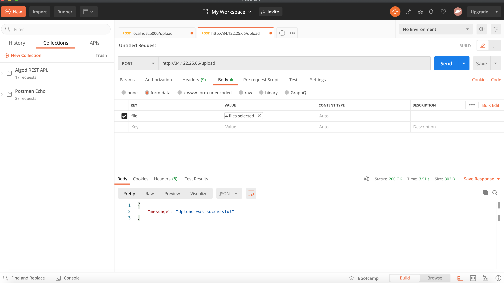
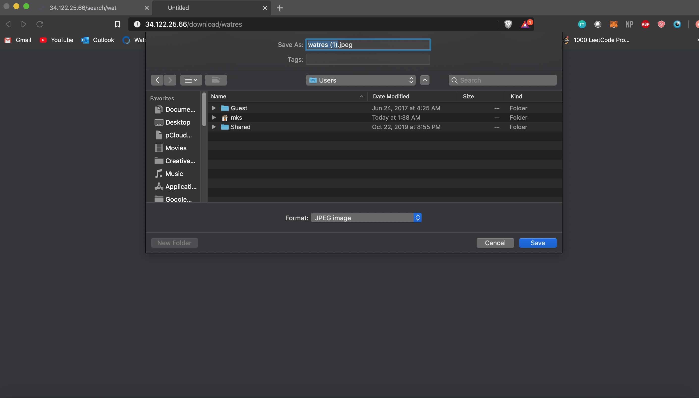
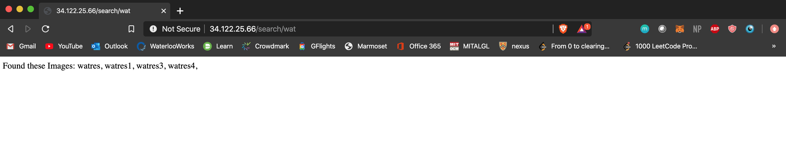
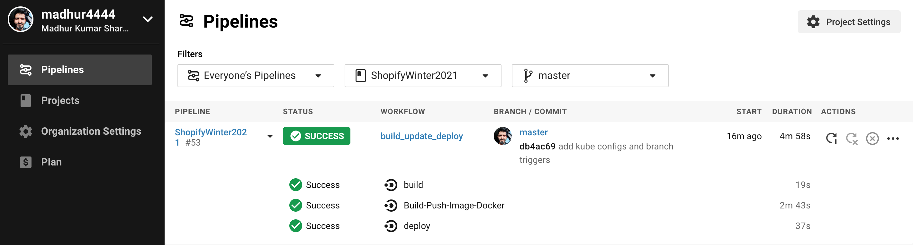
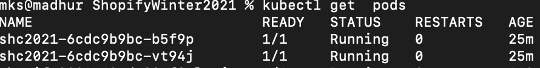
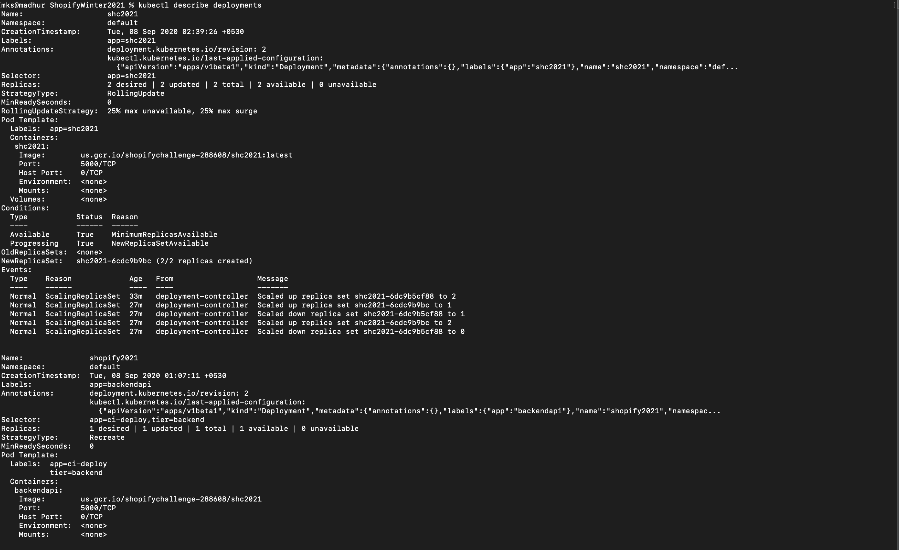
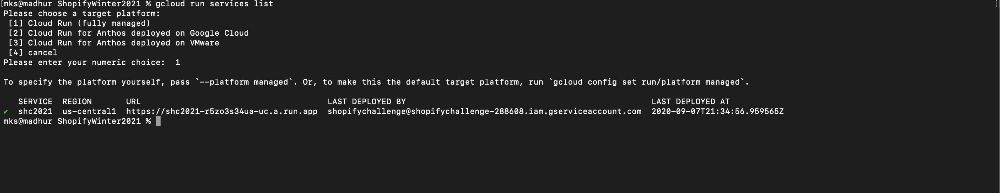

# ShopifyWinter2021
[](https://circleci.com/gh/madhur4444/ShopifyWinter2021)

Infrastructure challenge for Shopify Winter 2021
Image repositary written in typescript, containerized API deployed on Google Cloud Run and Google Kubernetes Engine using CircleCI pipeline

Public Production deployment Endpoint on Google Kubernetes Engine with 2 replica pods of API (Load balancer configured) - http://34.122.25.66/

Public Endpoint of API for fast CloudRun deployment (serverless architecture) for developer testing - https://shc2021-r5zo3s34ua-uc.a.run.app/

### Endpoints -

```
/upload
```


Supports both single and multiple image upload securely to Google cloud storage bucket




```
/download/:id
```


downloads image by name, no need for extension



```
/search/:id
```


Returns all possible images starting with given id uploaded, and displaying it in browser for readability and testing purposes only




#### CircleCI pipeline Build -




#### Confirm Deployments by Pipeline - 

##### Pods - 



##### Deployments describe -




##### Cloudrun - 




##### Possible Additions -

Didn't created frontend and added more features and authentication due to time constraints, instead decided to spend my time on infrastructure and deployments out of interest.

- Create Multi-regional GKE cluster to better serve worldwide audience for highly used API, though this won't receive that kinds of traffic.
- Configure Helm Charts for better maanagement of containers in GKE
- Use Terraform + Packer to setup spin up resources and create architecture

###### Branches - 
master, dev(for dev environment), dev-testing (for local testing)

For local testing on device switch to dev-testing branch and build API locally,

```
docker-compose build && docker-compose up
```

